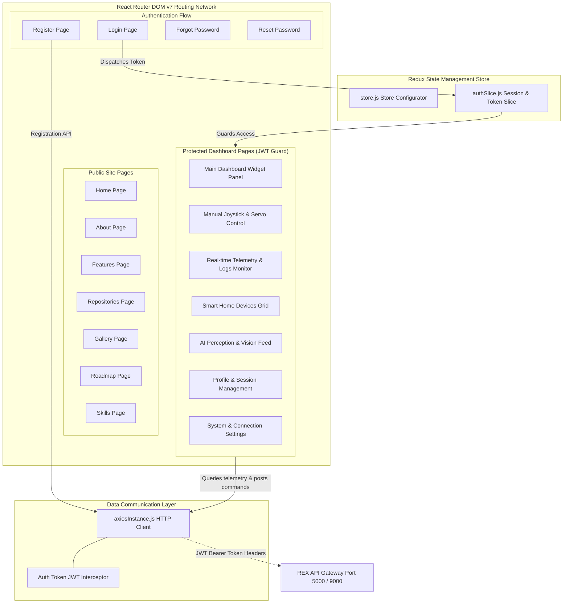

# 🤖 REX-47 Web Dashboard (v1.0.0)

> **Repository `03`** · Premium, state-of-the-art web interface for controlling, visualizing, and configuring the REX-47 autonomous robot car and smart home assistant. Built with React 19, Redux Toolkit, Tailwind CSS v4, and GSAP animations, it provides real-time telemetry charting, spatial AI perception visualization, manual locomotion joysticks, smart home device configuration grid, and security-validated user management.

[]()
[]()
[]()
[]()
[]()
[]()

---

## 🧭 System Architecture

The web dashboard is designed around a single-page application (SPA) model featuring route-based code-splitting, custom JWT validation guards, centralized state coordination, and modular network wrappers.



---

## 📦 Project Structure

```
03-rex-web-dashboard/
├── public/                    # Static assets & public resources
├── src/
│   ├── api/                  # API clients and global instances
│   │   └── axiosInstance.js  # Axios instance configured with JWT request interceptor
│   ├── assets/               # Images, brand designs, and custom vectors
│   ├── components/           # Reusable core structural layout components
│   │   ├── Header.jsx        # Top navigation panel
│   │   ├── Sidebar.jsx       # Left side navigation bar
│   │   └── Footer.jsx        # Footer disclaimer & quick info
│   ├── config/               # App configuration & endpoints
│   │   └── index.js          # Centralized configuration mapping environment variables
│   ├── pages/                # Page components
│   │   ├── auth/             # Session management & user account pages
│   │   │   ├── Login.jsx
│   │   │   ├── Register.jsx
│   │   │   ├── ForgotPassword.jsx
│   │   │   └── ResetPassword.jsx
│   │   ├── common/           # Public portfolio & informational pages
│   │   │   ├── Home.jsx
│   │   │   ├── About.jsx
│   │   │   ├── Features.jsx
│   │   │   ├── Repositories.jsx
│   │   │   ├── Roadmap.jsx
│   │   │   ├── Skills.jsx
│   │   │   └── Gallery.jsx
│   │   └── protected/        # Guarded dashboard pages (Authentication required)
│   │       ├── Dashboard.jsx        # Unified status metrics & widgets
│   │       ├── RobotControl.jsx     # Locomotion joysticks & pan-tilt sweeps
│   │       ├── RobotMonitoring.jsx  # Charted telemetries, IMU charts, & event logs
│   │       ├── SmartHome.jsx        # Auxiliary IoT devices & automation control grid
│   │       ├── AIPerception.jsx     # Computer vision annotations & threshold rules
│   │       ├── Profile.jsx          # Profile credentials & active token keys
│   │       ├── Settings.jsx         # Connection brokers & IP setups
│   │       └── Help.jsx             # Manuals, system maps, and guides
│   ├── store/                # Redux store system
│   │   ├── store.js          # Global store registration
│   │   └── authSlice.js      # Session payloads, loading states, and mutations
│   ├── App.jsx               # Main React entry router
│   ├── App.css               # Base Tailwind CSS rules
│   ├── main.jsx              # DOM mounter
│   └── index.css             # Root variables & styles
├── .env.example              # Environment variables template
├── eslint.config.js          # ESLint code-quality configurations
├── package.json              # App metadata, script definitions, & dependency manifests
├── vercel.json               # Vercel SPA rewriting configurations
└── vite.config.js            # Vite configuration bundling setups (with Tailwind v4 support)
```

---

## 💻 Tech Stack Details

The dashboard is engineered with cutting-edge frontend tools to deliver maximum speed, responsiveness, and premium visual layout aesthetics:
* **React 19 & JSX**: Capitalizes on modern hooks, functional layouts, and fast rendering.
* **Redux Toolkit (`@reduxjs/toolkit` / `react-redux`)**: Coordinates global application state, active JWT payloads, and authorization metadata across routes.
* **Tailwind CSS v4**: High-performance layout generation using the native `@tailwindcss/vite` compiler integration, enabling swift layouts and custom color systems without style sheets.
* **React Router DOM v7**: Handles client-side navigation, guarded routes, parameters parsing, and redirects.
* **GSAP (GreenSock Animation Platform)**: Drives premium page entrance animations, micro-interaction hover events, and loading states for a premium user experience.
* **Axios HTTP Client**: Integrated [axiosInstance.js](src/api/axiosInstance.js) configured with request interceptors to append authentication tokens on outgoing server requests.

---

## 📡 Configuration & Environment Variables

The application references a centralized configuration in [index.js](src/config/index.js) parsed from `.env` environment variables:

```javascript
export const config = {
  apiBaseUrl: import.meta.env.VITE_API_BASE_URL || 'http://localhost:5000/api',
  appName: import.meta.env.VITE_APP_NAME || 'REX-47 Dashboard',
  enableAnalytics: import.meta.env.VITE_ENABLE_ANALYTICS === 'true',
  // ...
};
```

### Environment Variable Options (`.env.example`)
To configure the application, create a `.env` or `.env.local` file:
```env
# API Gateway Target URL
VITE_API_BASE_URL=http://localhost:5000/api

# Dashboard Application Title
VITE_APP_NAME=REX-47 Dashboard

# Toggle user analytics tracking
VITE_ENABLE_ANALYTICS=false
```

### API Endpoints
Endpoints are divided into domain-specific paths targeting the REX API Gateway:
* **Auth**:
  * `/auth/login` | `/auth/register` | `/auth/logout`
  * `/auth/forgot-password` | `/auth/reset-password`
* **Robot**:
  * `/robot` (list) | `/robot/:id` (detail) | `/robot/:id/status` | `/robot/:id/control`
* **Smart Home**:
  * `/smart-home/devices` | `/smart-home/automations` | `/smart-home/scenes`
* **Monitoring**:
  * `/monitoring/sensors` | `/monitoring/telemetry` | `/monitoring/logs`

---

## 🔐 User Session & Authentication Flow

```
[Register Page] ──► [Login Page] ──► [API Gateway validates] ──► [Saves JWT to LocalStorage & Redux]
                                                                        │
[Dashboard Pages] ◄── [Axios Interceptor injects Token Bearer] ◄────────┘
        │
[401 Unauthorized Response] ──► [Clears local state] ──► [Redirects to /login]
```

1. **User Sign In**: User registers and signs in on `/login`. Upon successful authentication, the API returns a JWT access token.
2. **State Storage**: The login payload is processed via the [authSlice.js](src/store/authSlice.js) reducer, storing user metadata and the token in memory, backed by `localStorage` persistence.
3. **Guarded Routing**: Any request to `/dashboard`, `/robot-control`, etc., is wrapped by an authorization boundary in [App.jsx](src/App.jsx). Unauthenticated requests are immediately redirected back to `/login`.
4. **Outgoing Requests**: The axios client interceptor checks for the active token, appending an `Authorization: Bearer <token>` header to all outgoing requests.
5. **Unauthorized Handling**: If the API gateway returns a `401 Unauthorized` (e.g. token expired), the Axios interceptor catches the response, triggers a session cleanup, and redirects the browser back to the login page.

---

## 🚀 Getting Started

### Prerequisites
* **Node.js**: v16.0.0 or higher
* **npm**: v7.0.0 or higher

### Installation & Launch

1. **Clone the repository**
   ```bash
   git clone https://github.com/thathsarabandara/03-rex-web-dashbaord.git
   cd 03-rex-web-dashbaord
   ```

2. **Install all node packages**
   ```bash
   npm install
   ```

3. **Establish Local Environment variables**
   ```bash
   cp .env.example .env.local
   ```
   *Edit `.env.local` to match your development endpoints.*

4. **Launch the local development server**
   ```bash
   npm run dev
   ```
   *The app starts up at http://localhost:5173.*

### Build and Compilation
Build the production bundle and preview it locally:
```bash
# Compile bundle into /dist directory
npm run build

# Boot local server to preview compiled dist
npm run preview
```

---

## 📈 Feature Roadmap

| Component | Feature Description | Status |
|:---:|---|:---:|
| **Auth** | JWT User registration, login, and password resets | ✅ Implemented |
| **Auth** | Redux-backed session persistence & Axios token interceptors | ✅ Implemented |
| **Common** | Multi-page portfolio sites (Home, About, Features, Repositories, Roadmap, Skills, Gallery) | ✅ Implemented |
| **Dashboard**| Unified robot status cards, battery level widget, and task logs | ✅ Implemented |
| **Control** | Locomotion direction triggers & camera pan-tilt sliders | ✅ Implemented |
| **Monitor** | Real-time telemetry graphs, IMU accelerometers, and event logs | ✅ Implemented |
| **SmartHome**| Auxiliary IoT device automation grid and status indicators | ✅ Implemented |
| **Perception**| AI vision annotations and confidence levels charts | ✅ Implemented |
| **Network** | Real-time WebSockets / Server-Sent Events integration | ⏳ Planned |
| **Visuals** | Interactive 2D/3D SLAM mapping visualization | ⏳ Planned |
| **Fleet** | Multi-Robot Fleet tracking capabilities | ⏳ Planned |

---

<div align="center">
  <sub>Part of the <strong>REX-47</strong> Autonomous Robotic Platform Ecosystem</sub>
</div>
